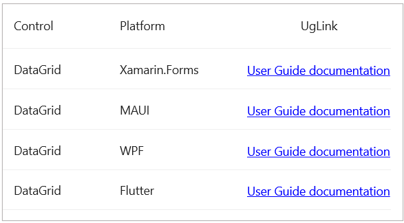

# How to create hyperlink column in MAUI DataGrid?
The [.NET MAUI DataGrid(SfDataGrid)](https://www.syncfusion.com/maui-controls/maui-datagrid) does not natively provide HyperlinkColumn support. You can achieve this by using [DataGridTemplateColumn](https://help.syncfusion.com/cr/maui/Syncfusion.Maui.DataGrid.DataGridTemplateColumn.html) and a customized label. 

## XAML
Define your DataGrid with the required customizations. Use a DataGridTemplateColumn to load a customized label for your HyperlinkColumn.

```XML
<syncfusion:SfDataGrid x:Name="dataGrid"
                    ItemsSource="{Binding ControlInfoCollection}" 
                    ColumnWidthMode="Auto">
    <syncfusion:SfDataGrid.Columns>
        <syncfusion:DataGridTextColumn MappingName="Control"/>
        <syncfusion:DataGridTextColumn MappingName="Platform"/>
        <syncfusion:DataGridTemplateColumn MappingName="UGLink">
            <syncfusion:DataGridTemplateColumn.CellTemplate>
                <DataTemplate>
                    <local:HyperlinkLabel Text="User Guide documentation"
                                        Url="{Binding UGLink}"
                                        VerticalTextAlignment="Center"/>
                </DataTemplate>
            </syncfusion:DataGridTemplateColumn.CellTemplate>
        </syncfusion:DataGridTemplateColumn>
    </syncfusion:SfDataGrid.Columns>
</syncfusion:SfDataGrid>
```

## C#
Define a customLabel named HyperlinkLabel that is inherited from Label. This customized control will represent the clickable hyperlink within the TemplateColumn.

### HyperlinkLabel.cs
 
 ```C#
public class HyperlinkLabel : Label
{
    public static readonly BindableProperty UrlProperty = BindableProperty.Create(nameof(Url), typeof(string), typeof(HyperlinkLabel), null);

    public string Url
    {
        get { return (string)GetValue(UrlProperty); }
        set { SetValue(UrlProperty, value); }
    }

    public HyperlinkLabel()
    {
        TextDecorations = TextDecorations.Underline;
        TextColor = Colors.Blue;
        GestureRecognizers.Add(new TapGestureRecognizer
        {
            Command = new Command(async () => await Launcher.OpenAsync(Url))
        });

    }
}
 ```


The following screenshot shows the Hyperlink Column in SfDataGrid.



Take a moment to pursue this [documentation](https://help.syncfusion.com/maui/datagrid/overview), where you can find more about Syncfusion .NET MAUI DataGrid (SfDataGrid) with code examples.
Please refer to this [link](https://www.syncfusion.com/maui-controls/maui-datagrid) to learn about the essential features of Syncfusion .NET MAUI DataGrid(SfDataGrid).
### Conclusion
I hope you enjoyed learning about how to create Hyperlink Column in MAUI DataGrid (SfDataGrid).

You can refer to our [.NET MAUI DataGrid’s feature tour](https://www.syncfusion.com/maui-controls/maui-datagrid) page to know about its other groundbreaking feature representations. You can also explore our .NET MAUI DataGrid Documentation to understand how to present and manipulate data.
For current customers, you can check out our .NET MAUI components from the [License and Downloads](https://www.syncfusion.com/account/downloads) page. If you are new to Syncfusion, you can try our 30-day free trial to check out our .NET MAUI DataGrid and other .NET MAUI components.
If you have any queries or require clarifications, please let us know in comments below. You can also contact us through our [support forums](https://www.syncfusion.com/forums), [Direct-Trac](https://support.syncfusion.com/account/login?ReturnUrl=%2Faccount%2Fconnect%2Fauthorize%2Fcallback%3Fclient_id%3Dc54e52f3eb3cde0c3f20474f1bc179ed%26redirect_uri%3Dhttps%253A%252F%252Fsupport.syncfusion.com%252Fagent%252Flogincallback%26response_type%3Dcode%26scope%3Dopenid%2520profile%2520agent.api%2520integration.api%2520offline_access%2520kb.api%26state%3D8db41f98953a4d9ba40407b150ad4cf2%26code_challenge%3DvwHoT64z2h21eP_A9g7JWtr3vp3iPrvSjfh5hN5C7IE%26code_challenge_method%3DS256%26response_mode%3Dquery) or [feedback portal](https://www.syncfusion.com/feedback/maui?control=sfdatagrid). We are always happy to assist you!